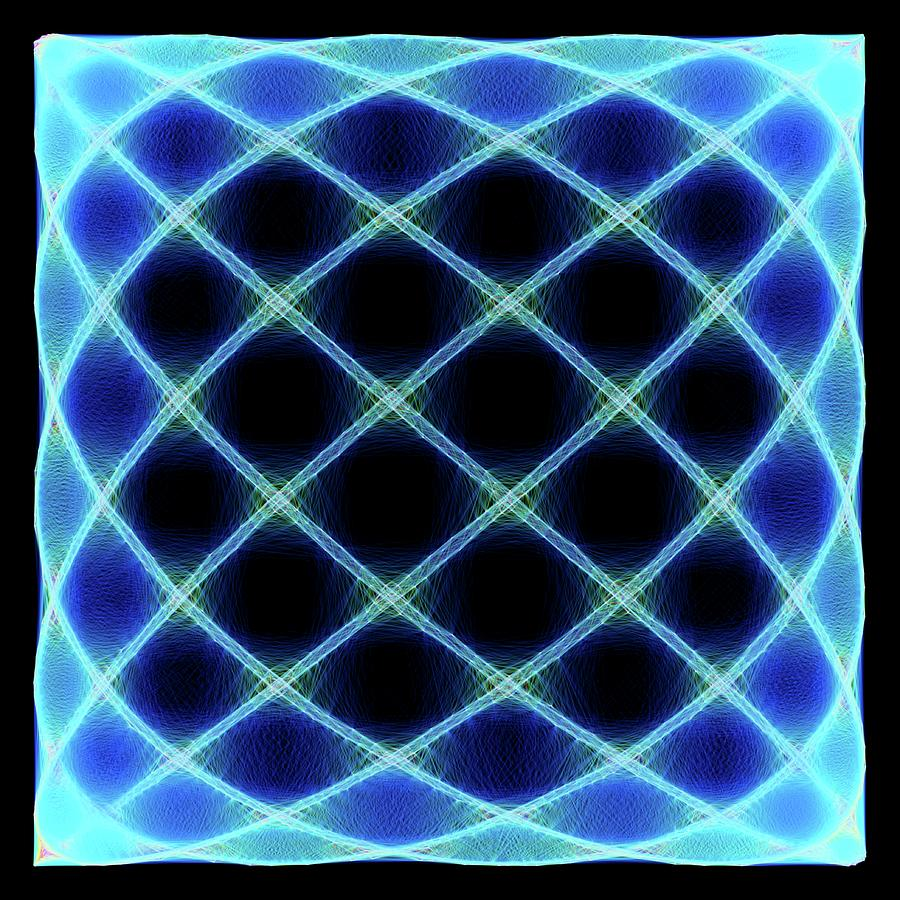

## Too Technical for a Knuckle-Dragging Ground Pounder?
My interest in software engineering stems from a love of creating and building things.  After leaving the Army in 2016, I searched for a career I would be satisfied with for the rest of my life.  I had always been fascinated by technology but felt that I lacked the skills and knowledge to pursue such a technical career.  It was in my second year of a biology degree that I purchased an Arduino kit as a hobby interest and discovered my passion for electronics and coding.  I quickly became engrossed in how the code I wrote could control the behavior of servos, motors, and sensors.  Within a month of buying that kit, I had already worked through the little book of beginner projects and was looking to build something from scratch.

That first project was a laser spirograph.  I had seen YouTube videos about how mounting small mirrors to the spindles of DC motors and bouncing a laser beam consecutively off multiple spinning mirrors could create these incredible Lissajous figures.  What set my imagination on fire was that the spinning of the mirrors, messily hot-glued and unbalanced to the shafts of those motors, oscillated and produced an audible vibration.

Growing up, I played the cello in the school orchestra and had a basic grasp of musical theory.  By playing with this laser toy I had built, I observed that by adjusting the various motors spinning at different speeds in such a way that they formed harmonic musical chords, the resultant projected laser patterns formed stable standing-wave figures that resembled flowers, stars, and more!  Let me emphasize how neat this is: the standing waves correspond to the phenomenon of what humans perceive as musical harmony!  Truly incredible.

Around this time, I was taking a pre-calculus class and had just learned how to parametrically describe the motion of a circle using sine and cosine functions.  Through building that laser spirograph, something within my brain clicked, and I had this tremendous sense of enjoyment spread through me as I was able to relate the abstract mathematical concepts of harmonic motion, first described by the likes of Euler, Fourier, and Hooke, to something I had built.  I discovered for the first time just how beautiful the universe's mathematics could be.

That experience made a few things apparent to me.  First, I did have a passion for this kind of thing.  Second, I had been ignorant of how amazing that "Aha!" feeling could be when something that seems on the periphery of relevance ends up being central to everything.  I didn't experience that enjoyment until I was almost 28 years old.  As a side note: math teachers, we should be teaching kids the cool stuff from the start!

In the future, I plan to develop my skills in programming further and design more sophisticated embedded systems and IoT projects.  I also hope to gain experience in developing software for different platforms, such as mobile and web applications and explore how these platforms intersect with the exciting advances in technologies such as artificial intelligence and machine learning.

Overall, my passion for creating and building things, combined with that first, and several more experiences since, have led me to pursue a career in computer and software engineering.  I look forward to continuing to develop my skills and knowledge in the field and hope to positively impact the world through what I create.

###### Here's a bonus: 
If you made it this far, you might be interested in this desmos graph I created around the same time the events discussed in this essay took place.  So have fun, and enjoy!

[Desmos 4-term Spirograph](https://www.desmos.com/calculator/gncahk4kea)
